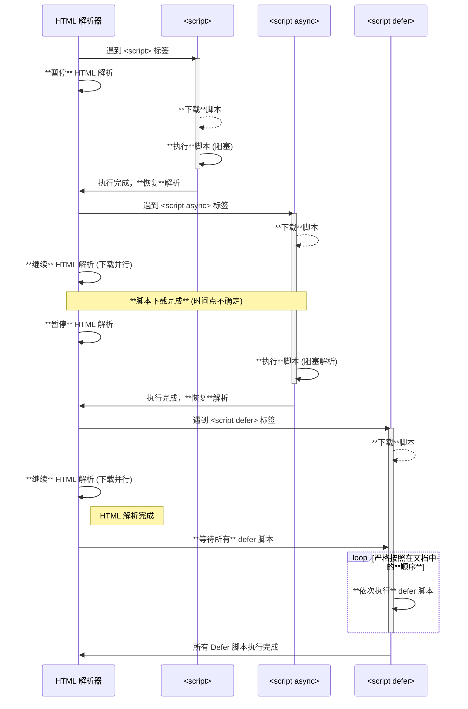

# script 标签中 `defer` 和 `async` 的区别

## 📝 概要

`defer` 与 `async` 都用于**异步加载外部脚本**，避免在脚本下载时阻塞 HTML 解析；但二者在**下载/执行时机与执行顺序**上有本质差异。理解差异能显著提升首屏性能与脚本依赖管理。

---

## 📌 核心知识点

- **阻塞行为（普通 `<script src>`）**：默认情况下，遇到外部脚本会暂停 HTML 解析 → 下载 → 执行 → 再继续解析，导致渲染阻塞。

- **`defer`：**

  - 外部脚本在后台并行下载（不阻塞解析）。

  - **执行时机**：在 DOM 完全解析后，且在 `DOMContentLoaded` 事件触发之前执行。

  - **执行顺序**：按在文档中出现的顺序执行（保持相对顺序）。

  - 仅对外部脚本（带 `src`）有效；内联脚本上的 `defer` 被忽略。

  - 适合：需要在 DOM 可用后执行、且脚本之间有执行顺序依赖的脚本。

- **`async`：**

  - 外部脚本在后台并行下载（不阻塞解析）。

  - **执行时机**：只要下载完成就立即执行（可能在 DOM 未解析完之前）。

  - **执行顺序**：与文档顺序无关，哪个先下载完哪个先执行。

  - 亦仅对外部脚本有效；内联脚本上的 `async` 被忽略。

  - 适合：独立脚本（无依赖 DOM 或其他脚本）——例如分析脚本、广告、统计。

- **`type="module"` 的脚本**：在现代浏览器下默认 **相当于 `defer`**（按文档顺序，在 DOM 解析后执行），并且有模块作用域与静态导入行为。

- **动态插入脚本（`document.createElement('script')`）**：

  - 默认行为类似 `async`（即动态脚本会异步下载并在就绪后立即执行）。

  - 可以通过设置 `script.async = false` 来强制让动态脚本表现得像 `defer`（按插入顺序执行）。

- **`DOMContentLoaded` 与两者的关系**：

  - `defer` 脚本执行完成后才触发 `DOMContentLoaded` 的回调（因为 `defer` 在 DOM 准备好后执行）。

  - `async` 脚本与 `DOMContentLoaded` 没有顺序保证：`DOMContentLoaded` 可能在 `async` 之前或之后触发，取决于 `async` 脚本何时下载并执行。

---

## 💻 示例代码

### 普通脚本（会阻塞）

```html
<!-- 解析到此处会暂停，下载并执行 scriptA，然后继续解析 -->
<script src="scriptA.js"></script>
<p>Content after scriptA</p>
```

### defer：并行下载，按顺序在 DOM 完成后执行

```html
<script defer src="long.js"></script>
<script defer src="small.js"></script>
<!-- long.js 和 small.js 并行下载，但执行时保持文档顺序：先 long.js 再 small.js -->
```

### async：并行下载，下载完成就立刻执行（无顺序保证）

```html
<script async src="long.js"></script>
<script async src="small.js"></script>
<!-- small.js 先下载完就可能先执行，文档顺序不保证 -->
```

### 动态插入脚本（默认 async）

```js
const s = document.createElement('script');
s.src = '/path/to/lib.js';
document.body.appendChild(s); // 默认：异步下载，下载完成立即执行（类似 async）
```

### 动态插入脚本，按顺序执行（async=false → 行为类似 defer）

```js
function loadSequential(src) {
  const s = document.createElement('script');
  s.src = src;
  s.async = false; // 保持插入顺序执行
  document.body.appendChild(s);
}
loadSequential('/long.js');
loadSequential('/small.js');
// long.js 将先于 small.js 执行（按插入顺序）
```

### `type="module"`（默认类似 defer，且按顺序执行）

```html
<script type="module" src="/app.module.js"></script>
<script type="module" src="/another.module.js"></script>
<!-- modules 按顺序在 DOM 解析后执行，并支持 ES module 语法 -->
```

---

## ⚠️ 常见误区

- **误区：`async` / `defer` 对内联脚本有效。**  
    实际：两者只对带 `src` 的外部脚本有意义，内联脚本会忽略这两个属性。

- **误区：`async` 比 `defer` 更快（或更好）。**  
    不是“更快”，只是行为不同：`async` 更“立即”，但不可控顺序且可能在 DOM 就绪前运行，若脚本依赖 DOM/其他脚本会出问题。

- **误区：动态插入脚本总是同步/按顺序执行。**  
    默认情况下动态插入的脚本是异步执行（像 `async`）。要按顺序执行需显式设置 `async = false` 或链式回调。

- **误区：`type="module"` 与 `defer` 无关。**  
    现代浏览器把模块脚本默认当作延迟脚本处理（等 DOM 解析完成再执行），但模块还有自己的行为（例如顶层 `await`、模块作用域等）。

- **误区：只要加 `defer` 就可以随便排序依赖脚本。**  
    `defer` 保持文档中脚本的相对顺序，但仍需开发者正确组织依赖关系与加载位置（例如放在 `<head>` 还是 body）。

---

## 🎯 适用场景

- **使用 `defer`：**

  - 应用主脚本、需要 DOM 可用后执行的初始化脚本。

  - 多个脚本之间有依赖且需要保持执行顺序。

  - 想让脚本在 `DOMContentLoaded` 触发前执行完毕。

- **使用 `async`：**

  - 第三方统计、广告、社交分享按钮等**独立**脚本（不依赖 DOM 或其它脚本）。

  - 希望尽早执行但不破坏页面解析的独立逻辑。

- **不使用任何属性（默认阻塞）或放在 body 底部：**

  - 极少数依赖必须在 DOM 解析中间执行的脚本（很罕见）。

  - 简单页面且脚本非常小，放在 `</body>` 底部仍是可行选择。

- **动态加载脚本：**

  - 按需加载模块、延迟加载非关键脚本。可通过 `async=false` 控制顺序，或用模块化打包工具（如 webpack 的 code-splitting）+ `type="module"`。

---

## 总结

### 1. 普通 `<script>` (同步阻塞)

- **加载/执行模式：** 串行。

- **对 HTML 解析的影响：**

  - 浏览器遇到 `<script src>` 时，**立即暂停** HTML 解析。

  - 脚本下载完成后，**立即同步执行**（继续阻塞）。

  - 执行完毕后，HTML 解析才 **恢复**。

- **结论：** 对页面渲染和 **首屏性能** 影响**最大**。

### 2. `<script async>` (异步下载，阻塞执行)

- **加载/执行模式：** **异步下载**，立即**同步执行**。

- **对 HTML 解析的影响：**

  - 脚本在后台**异步下载**，**不阻塞** HTML 解析。

  - 一旦下载完成，会**立即暂停** HTML 解析并同步 **执行**。

  - **⚠️ 风险：** 执行时机不确定，可能在 DOM 构建完成前执行。脚本若尝试操作后续的 DOM 元素，**会因元素不存在而报错**。

- **执行顺序：** **不保证顺序**（谁先下载完谁先执行）。

- **适用场景：** 适用于独立、**不依赖 DOM 或其它脚本** 的第三方工具脚本（如统计、广告追踪）。

### 3. `<script defer>` (异步下载，延迟执行)

- **加载/执行模式：** 异步下载，**延迟同步执行**。

- **对 HTML 解析的影响：**

  - 脚本在后台**异步下载**，**不阻塞** HTML 解析。

  - 脚本执行会**延迟**到 **HTML 解析完成** 后才开始，**执行过程不阻塞** 解析。

- **执行顺序：** 严格保证 **按文档中出现的顺序** 依次执行，并在 `DOMContentLoaded` 事件触发**前**完成。

- **适用场景：** 适用于按顺序执行且**依赖完整 DOM 结构** 的初始化脚本（如应用主逻辑、组件库加载）。



---

## 🔗 关联笔记

- [[预加载与预连接全解析]]
## 🏷️ 标签

- #javascript #html #性能优化 #script #defer #async
