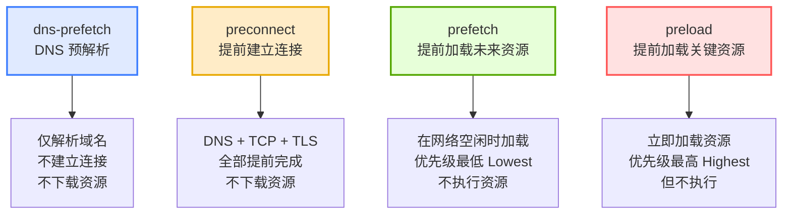

# 预加载与预连接全解析（preload / prefetch / dns-prefetch / preconnect）

## 📝 概要

四种浏览器性能优化机制的区别：

- `preload`：**立即加载，最高优先级**

- `prefetch`：**空闲时加载，为未来页面做准备**

- `dns-prefetch`：**提前解析域名**

- `preconnect`：**提前建立连接（TCP + TLS）**

---

## 📌 核心知识点

### 1. **preload – 立即加载资源（高优先级）**

- 高优先级（Highest）

- 当前页面必定会用到的资源

- 加载 ≠ 执行（例如 preload 的 CSS/JS 需要真正插入后才会生效）

- 不阻塞渲染（不会影响关键渲染路径）

**适用于：**  
首屏关键 CSS、折叠前可见区图片、重要 JS、字体（font）

---

### 2. **prefetch – 在空闲时加载资源（低优先级）**

- 低优先级（Lowest）

- 浏览器网络空闲时才进行加载

- 适用于下一个页面可能会使用的资源

- 加载后进入缓存，下次使用时无需再次下载

- 同样不会执行，只是缓存

**适用于：**  
未来页面的 JS、CSS、图片等 —— **提前加载**

---

### 3. **dns-prefetch – 提前做 DNS 查询（极轻量）**

- 提前解析域名，减少后续请求的 DNS 延迟

- 不建立 TCP/TLS 连接，只做 DNS lookup

**适用于：**

- 第三方域名（CDN、图片、监控、广告等）

- 对性能影响小但成本极低

---

### 4. **preconnect – 提前建立 TCP + TLS 连接（比 dns-prefetch 更快）**

- 建立 DNS、TCP、TLS（HTTPS）连接

- 页面要从某域名加载重要资源时，可以节省建立连接的延迟

⚠️ **代价高于 dns-prefetch**，不要滥用，因为会消耗额外的连接资源。

**适用于：**

- 字体文件服务器

- CDN 静态资源

- API 请求域名

---

## 📊 四者对比表（最清晰版本）

|Hint 类型|作用|何时执行|是否阻塞渲染|会不会执行资源|优先级|是否跨域握手提前|
|---|---|---|---|---|---|---|
|**dns-prefetch**|DNS 预解析|空闲时|❌ 不阻塞|N/A|最低|❌|
|**preconnect**|提前建立 TCP / TLS 连接|空闲时（较早）|❌ 不阻塞|N/A|较低|✅（TCP + TLS）|
|**prefetch**|空闲时加载未来可能用到的资源|空闲时|❌ 不阻塞|❌ 不执行|**Lowest**|❌|
|**preload**|提高优先级，立即下载关键资源|立即|❌ 不阻塞渲染但会提前加载|❌ 不执行|**Highest**|❌|



---

## 💻 示例代码

### ### 1. preload

```html
<link rel="preload" href="/style.css" as="style">
<link rel="preload" href="/main.js" as="script">
<link rel="preload" href="/font.woff2" as="font" type="font/woff2" crossorigin>
```

### 2. prefetch

```html
<link rel="prefetch" href="/next-page.js" as="script">
<link rel="prefetch" href="/next-page.css" as="style">
```

### 3. dns-prefetch

```html
<link rel="dns-prefetch" href="//cdn.example.com">
<link rel="dns-prefetch" href="//img.example.com">
```

### 4. preconnect

```html
<link rel="preconnect" href="https://cdn.example.com" crossorigin>
<link rel="preconnect" href="https://fonts.googleapis.com" crossorigin>
```

---

## ⚠️ 常见误区

- **误区 1：preload 会执行 CSS/JS**  
    ✔️ 只下载，不执行

- **误区 2：preload + script 会触发重复请求**  
    ❌ Browsers 会复用缓存，不会重复下载  
    ✔️ 但 preload + prefetch 同时指向同一资源 → 会重复请求！

- **误区 3：prefetch 适合当前页面**  
    ❌ 错，它是给“未来页面”准备的资源

- **误区 4：滥用 preconnect 会建立大量 TCP/TLS 连接**  
    ✔️ 会增加服务器压力  
    ✔️ 会影响 mobile 性能

---

## 🎯 适用场景

### preload

- 首屏 CSS / JS

- 字体（最重要）

- Hero 图片

- Video poster

### prefetch

- 下一页路由所需 JS（配合 SPA）

- 用户可能跳转的页面

- 边缘行为预测（根据操作预取）

### dns-prefetch

- 第三方资源（CDN、图片、监控）

- 广告脚本域名

### preconnect

- 字体

- 静态 CDN

- API 域名（首屏数据）

---

## 🔍 深度细节补充

### 1. **preload 与 prefetch 下载后不执行**

JS 不会执行，CSS 不会应用。  
页面渲染不会因此阻塞。

---

### 2. **页面跳转时：正在加载的 preload/prefetch 会被取消**

如你提到的示例，第一个页面跳走时：

- 未完成的请求会被 `Cancel`

- 若资源设置了缓存，则第二次加载会直接命中缓存

---

### 3. **preload / prefetch 使用同一个资源 → 不会重复请求**

但：

### ❗ preload + prefetch 指向同一个资源 → 会重复请求

这是规范规定的不同优先级行为。

---

## 🔗 关联笔记

- [[浏览器事件模型]]
- [[script标签中defer和async的区别]]

---

## 🏷️ 标签

- #performance #browser #HTML #预加载 #资源优化
